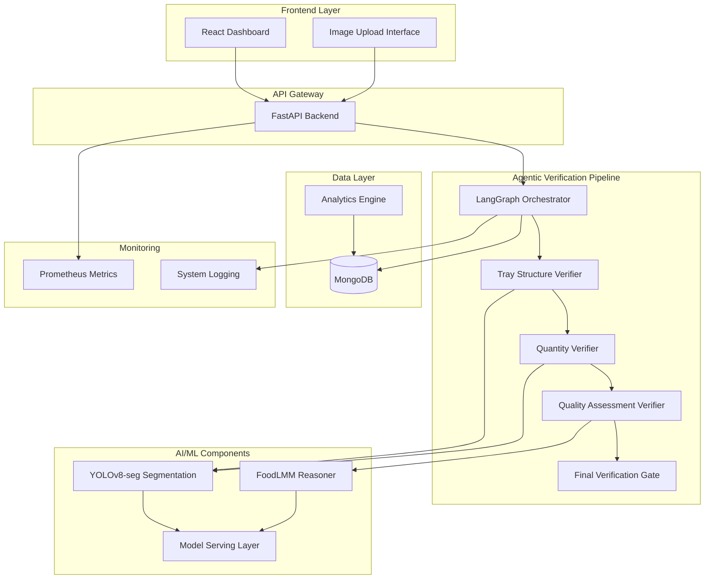
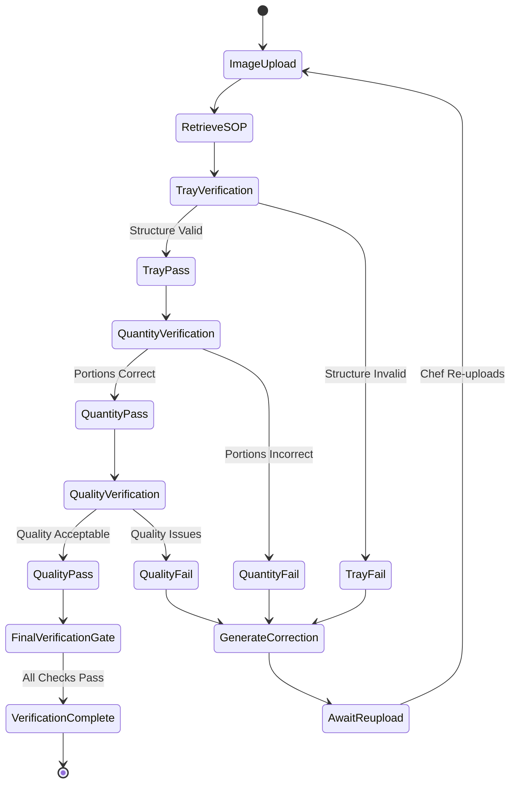

# Design Document: Mealawe Kitchen Vendor Automation

## Overview

The Mealawe Kitchen Vendor Automation system is a real-time agentic verification platform that automates quality and quantity audits in kitchen operations. The system implements a sequential verification pipeline (tray structure → quantity → quality → final verification) using computer vision and semantic reasoning to ensure food quality compliance while reducing manual inspection overhead.

The system operates as an agentic loop combining structural computer vision (YOLOv8-seg) with semantic reasoning (FoodLMM) to provide automated food quality control. When a chef uploads an image, the system retrieves SOP Ground Truth from MongoDB, performs sequential verification checks, and generates actionable corrective instructions when issues are detected.

## Architecture

### High-Level System Architecture



### Sequential Verification Flow



## Components and Interfaces

### Core Components

#### 1. LangGraph Orchestrator
**Purpose**: Manages the sequential verification workflow as a state machine
**Key Responsibilities**:
- Orchestrates the three-stage verification pipeline
- Maintains conversation state for multi-turn corrective loops
- Persists verification state in MongoDB
- Handles workflow transitions and error recovery

**Interface**:
```python
class LangGraphOrchestrator:
    def process_verification_request(self, order_id: str, image_data: bytes) -> VerificationResult
    def handle_correction_cycle(self, order_id: str, previous_state: dict) -> CorrectionState
    def persist_workflow_state(self, order_id: str, state: dict) -> bool
```

#### 2. Tray Structure Verifier
**Purpose**: First checkpoint - validates tray compartment structure
**Key Responsibilities**:
- Uses YOLOv8-seg for compartment detection (94-98% mAP)
- Validates compartment count and arrangement
- Generates tray-specific corrective actions

**Interface**:
```python
class TrayStructureVerifier:
    def verify_tray_structure(self, image: np.ndarray, sop_requirements: dict) -> TrayVerificationResult
    def detect_compartments(self, image: np.ndarray) -> List[CompartmentMask]
    def validate_structure(self, compartments: List[CompartmentMask], requirements: dict) -> bool
```

#### 3. Quantity Verifier
**Purpose**: Second checkpoint - validates portion quantities against SOP
**Key Responsibilities**:
- Uses geometric markers (rib-lines) for portion measurement
- Achieves 88-92% accuracy for quantity verification
- Cross-references counts with SOP Ground Truth

**Interface**:
```python
class QuantityVerifier:
    def verify_quantities(self, compartments: List[CompartmentMask], sop_ground_truth: dict) -> QuantityResult
    def measure_liquid_portions(self, compartment: CompartmentMask) -> float
    def count_discrete_items(self, compartment: CompartmentMask) -> int
```

#### 4. Quality Assessment Verifier
**Purpose**: Third checkpoint - assesses food quality using semantic reasoning
**Key Responsibilities**:
- Uses FoodLMM for reasoning segmentation (75-85% accuracy)
- Identifies quality issues (burnt, watery, texture problems)
- Generates quality-specific corrective actions

**Interface**:
```python
class QualityAssessmentVerifier:
    def assess_quality(self, compartments: List[CompartmentMask]) -> QualityResult
    def detect_quality_issues(self, compartment: CompartmentMask) -> List[QualityIssue]
    def generate_quality_corrections(self, issues: List[QualityIssue]) -> List[str]
```

#### 5. Final Verification Gate
**Purpose**: Combines results from all three checkpoints
**Key Responsibilities**:
- Applies logic gate to tray, quantity, and quality results
- Determines overall pass/fail status
- Triggers completion or correction workflows

**Interface**:
```python
class FinalVerificationGate:
    def apply_verification_logic(self, tray_result: bool, quantity_result: bool, quality_result: bool) -> FinalResult
    def generate_final_report(self, all_results: dict) -> VerificationReport
```

### AI/ML Components

#### YOLOv8-seg Segmentation Engine
**Purpose**: Compartment detection and segmentation
**Architecture**: YOLOv8-small-seg for production (upgraded from nano for seed training)
**Performance Target**: 94-98% mAP
**Training Pipeline**: 100 seed images → 4,300+ auto-annotated with HITL verification

#### FoodLMM Reasoning Engine
**Purpose**: Semantic quality assessment with reasoning segmentation
**Architecture**: Extends LISA, integrates LLaVA with SAM using segmentation tokens
**Capabilities**: Food-specific reasoning, quality issue identification
**Performance Target**: 75-85% accuracy

### Data Management Components

#### MongoDB Schema Design
**Collections**:
- `orders`: Order metadata with embedded SOP requirements
- `kitchens`: Kitchen profiles and performance metrics
- `verification_states`: Persistent workflow states for correction loops
- `annotations`: Image-mask-label mappings for training pipeline
- `analytics`: Time-series verification results

#### Analytics Engine
**Purpose**: Real-time performance analytics and dashboard data
**Implementation**: MongoDB aggregation pipelines for time-series analysis
**Metrics**: SOP adherence rates, correction times, kitchen performance trends

## Data Models

### Core Data Models

#### Order Model
```python
class Order:
    order_id: str
    kitchen_id: str
    items: List[OrderItem]
    sop_ground_truth: dict  # e.g., {"3 Roti": 3, "1 Dal": 1}
    verification_history: List[VerificationAttempt]
    current_state: str  # "pending", "in_progress", "verified", "rejected"
    created_at: datetime
    updated_at: datetime

class OrderItem:
    item_name: str
    quantity: int
    add_ons: List[str]  # Up to 4 add-ons
    quality_standards: dict
```

#### Verification Models
```python
class VerificationAttempt:
    attempt_id: str
    order_id: str
    image_url: str
    timestamp: datetime
    tray_result: TrayVerificationResult
    quantity_result: QuantityResult
    quality_result: QualityResult
    final_result: FinalResult
    correction_actions: List[str]

class TrayVerificationResult:
    passed: bool
    compartments_detected: int
    compartments_expected: int
    compartment_masks: List[CompartmentMask]
    issues: List[str]

class QuantityResult:
    passed: bool
    item_quantities: dict  # {"Roti": 3, "Dal": 0.8}
    expected_quantities: dict
    discrepancies: List[QuantityDiscrepancy]

class QualityResult:
    passed: bool
    quality_scores: dict  # Per compartment quality assessment
    issues: List[QualityIssue]
    reasoning: str  # FoodLMM explanation
```

#### AI Model Data
```python
class CompartmentMask:
    compartment_id: str
    polygon_coordinates: List[Tuple[float, float]]
    confidence_score: float
    item_type: str
    bounding_box: BoundingBox

class QualityIssue:
    issue_type: str  # "burnt", "watery", "portion_size", "texture"
    severity: float  # 0.0 to 1.0
    affected_area: CompartmentMask
    description: str
    correction_suggestion: str
```

#### Kitchen and Analytics Models
```python
class Kitchen:
    kitchen_id: str
    name: str
    location: str
    performance_metrics: KitchenMetrics
    sop_configurations: dict
    active_orders: List[str]

class KitchenMetrics:
    sop_adherence_rate: float
    average_correction_time: float
    total_verifications: int
    success_rate: float
    last_updated: datetime

class AnalyticsRecord:
    record_id: str
    kitchen_id: str
    order_id: str
    verification_result: bool
    processing_time: float
    correction_cycles: int
    timestamp: datetime
```

### MongoDB Document Structure

#### Orders Collection
```json
{
  "_id": "order_12345",
  "kitchen_id": "kitchen_001",
  "items": [
    {
      "item_name": "Roti",
      "quantity": 3,
      "add_ons": ["extra_ghee"],
      "quality_standards": {"texture": "soft", "color": "golden"}
    }
  ],
  "sop_ground_truth": {
    "Roti": 3,
    "Dal": 1,
    "Rice": 1
  },
  "verification_history": [
    {
      "attempt_id": "attempt_001",
      "timestamp": "2024-01-15T10:30:00Z",
      "image_url": "s3://images/order_12345_attempt_001.jpg",
      "results": {
        "tray_passed": true,
        "quantity_passed": false,
        "quality_passed": true,
        "final_result": false
      },
      "correction_actions": ["Rice portion is low; fill to the top zig-zag line"]
    }
  ],
  "current_state": "awaiting_correction",
  "workflow_state": {
    "current_stage": "quantity_verification",
    "correction_cycle": 1,
    "previous_failures": ["quantity"]
  }
}
```

#### Annotations Collection (Training Pipeline)
```json
{
  "_id": "annotation_001",
  "image_url": "s3://training/image_001.jpg",
  "order_id": "order_12345",
  "yolo_generated_masks": [
    {
      "compartment_id": "comp_1",
      "polygon": [[x1, y1], [x2, y2], ...],
      "confidence": 0.95,
      "predicted_class": "roti_compartment"
    }
  ],
  "hitl_verified_masks": [
    {
      "compartment_id": "comp_1",
      "polygon": [[x1, y1], [x2, y2], ...],
      "verified_class": "roti_compartment",
      "human_annotator": "annotator_001",
      "verification_timestamp": "2024-01-15T09:00:00Z"
    }
  ],
  "annotation_status": "verified",
  "training_phase": "production"  // "seed" or "production"
}
```

Now I need to use the prework tool to analyze the acceptance criteria before writing the Correctness Properties section:

<function_calls>
<invoke name="prework">
<parameter name="featureName">mealawe-kitchen-automation

## Correctness Properties

*A property is a characteristic or behavior that should hold true across all valid executions of a system—essentially, a formal statement about what the system should do. Properties serve as the bridge between human-readable specifications and machine-verifiable correctness guarantees.*

Based on the prework analysis and property reflection to eliminate redundancy, the following properties validate the core correctness requirements of the Mealawe Kitchen Automation system:

### Property 1: Sequential Verification Pipeline Ordering
*For any* verification request with order ID and image, the system should always execute verification stages in the exact sequence: tray structure verification → quantity verification → quality assessment → final verification gate, with each stage completing before the next begins.
**Validates: Requirements 1.1, 1.3, 1.5, 2.5, 3.5**

### Property 2: Stage Failure Isolation
*For any* verification stage that fails (tray, quantity, or quality), the system should immediately halt the pipeline, generate stage-specific corrective actions, and never proceed to subsequent verification stages.
**Validates: Requirements 1.2, 1.4, 2.4, 3.4, 4.5**

### Property 3: Compartment Detection Accuracy
*For any* tray image processed by the YOLOv8-seg model, the compartment detection should achieve between 94-98% mAP accuracy when measured against ground truth annotations.
**Validates: Requirements 2.1**

### Property 4: Compartment Validation Logic
*For any* detected compartment configuration and corresponding order requirements, the validation logic should correctly determine structural compliance by comparing compartment count and arrangement against SOP specifications.
**Validates: Requirements 2.2**

### Property 5: SOP Data Retrieval Consistency
*For any* order ID that passes tray structure verification, the system should successfully retrieve the corresponding SOP Ground Truth from MongoDB and make it available for quantity verification.
**Validates: Requirements 3.1**

### Property 6: Quantity Verification Accuracy
*For any* quantity verification performed using rib-line geometric markers, the system should achieve between 88-92% accuracy when measured against known portion standards.
**Validates: Requirements 3.2**

### Property 7: Liquid Measurement Algorithm
*For any* compartment containing liquid items, the quantity verification should use vertical rib markers for depth estimation and portion measurement rather than alternative measurement methods.
**Validates: Requirements 3.3**

### Property 8: Quality Assessment Accuracy
*For any* quality assessment performed by the FoodLMM reasoner, the system should achieve between 75-85% accuracy in identifying quality issues when measured against expert human assessments.
**Validates: Requirements 4.1**

### Property 9: Quality Issue Detection Capabilities
*For any* food item with known quality problems (burnt, watery, or texture issues), the reasoning segmentation should correctly identify and classify the specific type of quality issue present.
**Validates: Requirements 4.2**

### Property 10: Final Verification Logic Gate
*For any* combination of tray verification result, quantity verification result, and quality assessment result, the final verification gate should apply correct boolean logic: pass only when all three stages pass, fail when any stage fails.
**Validates: Requirements 4.3, 4.4**

### Property 11: Corrective Action Generation
*For any* verification failure (tray, quantity, or quality), the system should generate specific, actionable correction instructions that precisely describe the issue and required remediation steps.
**Validates: Requirements 8.1, 8.2**

### Property 12: Correction Loop State Management
*For any* multi-turn correction cycle, the system should persist verification state in MongoDB, compare new uploads against previous failure logs, and maintain complete audit trails until successful verification closure.
**Validates: Requirements 8.3, 8.4, 8.5**

### Property 13: Training Data Association Integrity
*For any* image in the training pipeline, the system should maintain consistent mappings between raw images, YOLO-generated polygon masks, and HITL-verified labels in MongoDB without data loss or corruption.
**Validates: Requirements 12.4**

## Error Handling

### Error Categories and Handling Strategies

#### 1. AI Model Failures
**Segmentation Failures**: When YOLOv8-seg fails to detect compartments
- Fallback: Request image re-upload with guidance on lighting/angle
- Logging: Capture failure mode for model improvement
- User Feedback: "Unable to detect tray compartments. Please ensure good lighting and clear view of entire tray."

**Quality Assessment Failures**: When FoodLMM cannot process compartment crops
- Fallback: Mark as requiring manual inspection
- Escalation: Route to human quality inspector
- State Persistence: Maintain workflow state for later retry

#### 2. Data Retrieval Failures
**SOP Ground Truth Missing**: When order ID has no corresponding SOP data
- Fallback: Use default SOP template for kitchen
- Alert: Notify kitchen management of missing SOP configuration
- Workflow: Allow manual SOP entry for immediate processing

**MongoDB Connection Issues**: When database is unavailable
- Retry Logic: Exponential backoff with circuit breaker
- Caching: Use local cache for recent SOP data
- Graceful Degradation: Queue requests for later processing

#### 3. Workflow State Corruption
**Incomplete Verification States**: When correction loops are interrupted
- Recovery: Reconstruct state from audit trail
- Validation: Verify state consistency before resuming
- Fallback: Restart verification from beginning if state is unrecoverable

#### 4. Performance Degradation
**Latency Threshold Violations**: When processing exceeds 3-second target
- Monitoring: Prometheus alerts for latency spikes
- Scaling: Auto-scale model serving infrastructure
- Circuit Breaker: Temporarily route to simplified verification mode

### Error Recovery Patterns

#### Retry with Exponential Backoff
```python
@retry(
    stop=stop_after_attempt(3),
    wait=wait_exponential(multiplier=1, min=4, max=10)
)
def verify_with_retry(order_id: str, image_data: bytes) -> VerificationResult:
    return verification_pipeline.process(order_id, image_data)
```

#### Circuit Breaker for External Dependencies
```python
circuit_breaker = CircuitBreaker(
    failure_threshold=5,
    recovery_timeout=30,
    expected_exception=ModelServingException
)

@circuit_breaker
def call_foodlmm_service(image_crop: np.ndarray) -> QualityAssessment:
    return foodlmm_client.assess_quality(image_crop)
```

## Testing Strategy

### Dual Testing Approach

The system requires both unit testing and property-based testing to ensure comprehensive coverage:

**Unit Tests**: Focus on specific examples, edge cases, and integration points
- Specific verification scenarios with known inputs/outputs
- Error condition handling (network failures, malformed data)
- Integration between components (API endpoints, database operations)
- Edge cases (empty images, corrupted data, missing SOPs)

**Property Tests**: Verify universal properties across all inputs
- Sequential workflow ordering across random verification requests
- Accuracy thresholds across diverse test datasets
- State persistence consistency across correction cycles
- Data integrity across training pipeline operations

### Property-Based Testing Configuration

**Testing Framework**: Use Hypothesis (Python) for property-based testing
**Test Configuration**: Minimum 100 iterations per property test
**Test Tagging**: Each property test must reference its design document property

**Example Property Test Structure**:
```python
@given(
    order_id=st.text(min_size=1),
    image_data=st.binary(min_size=1000),
    sop_data=st.dictionaries(st.text(), st.integers(min_value=1))
)
@settings(max_examples=100)
def test_sequential_verification_ordering(order_id, image_data, sop_data):
    """
    Feature: mealawe-kitchen-automation, Property 1: Sequential Verification Pipeline Ordering
    """
    # Test implementation
    pass
```

### Testing Phases

#### Phase 1: Component Testing
- Unit tests for individual verifiers (tray, quantity, quality)
- Property tests for AI model accuracy thresholds
- Integration tests for MongoDB operations
- Performance tests for sub-3-second latency requirement

#### Phase 2: Workflow Testing
- Property tests for sequential pipeline ordering
- Unit tests for correction loop scenarios
- Integration tests for LangGraph state management
- End-to-end tests for complete verification cycles

#### Phase 3: System Testing
- Load testing with 4,405+ order dataset
- Property tests for data consistency across scaling
- Chaos engineering for error recovery validation
- Performance testing under concurrent load

### Test Data Management

**Training Data**: Use the 4,405 order dataset with proper train/validation/test splits
**Synthetic Data**: Generate additional test cases for edge conditions
**Ground Truth**: Maintain expert-annotated test sets for accuracy validation
**Privacy**: Ensure test data complies with food safety and privacy requirements

### Continuous Testing

**CI/CD Integration**: All property tests run on every commit
**Performance Monitoring**: Continuous accuracy monitoring in production
**Regression Testing**: Automated testing when models are updated
**A/B Testing**: Compare model versions using property-based metrics

## Implementation Roadmap

### Phase 1: Foundation, Data Preprocessing & "Seed" Dataset

This phase focuses on converting raw, messy assets into high-quality training data.

#### 1.1. Metadata Preprocessing (The "Brain" Preparation)
- **ETL Pipeline**: Extract 4,405 order rows and perform text normalization using pandas
- **Text Unification**: Map categorical values in itemDescription column (e.g., "Chapati" and "Roti" → single roti class)
- **JSON Ground Truth**: Convert unstructured descriptions into structured format (e.g., {"roti": 3, "dal": 1})
- **Outlier Handling**: Implement business rules to flag impossible values (e.g., "99 rotis")

#### 1.2. Image Preprocessing & "Seed" Annotation
- **Geometric Augmentation**: Apply rotations and scaling for various shooting angles
- **Lighting Normalization**: Use color perturbation (brightness/contrast adjustment)
- **Seed Labeling**: Manually trace polygons for ~100 diverse images in CVAT
- **Initial Training**: Train YOLOv8-nano-seg model on seed set using Ultralytics SDK

### Phase 2: Model-Assisted Labeling & Scaled Training

This phase uses AI to speed up labeling of the remaining 4,300+ images.

#### 2.1. CVAT Integration with Nuclio
- **Function Deployment**: Wrap YOLOv8-nano-seg model as Nuclio serverless function
- **CVAT Registration**: Register model in CVAT for automatic annotation
- **Auto-Annotation**: Use CVAT "Automatic Annotation" tool across entire dataset

#### 2.2. Human-in-the-Loop (HITL) Refinement
- **Verification**: Manually review AI-suggested labels and correct errors
- **Quality Assurance**: Ensure clean production dataset with accurate boundaries
- **Final Training**: Retrain YOLOv8-small-seg model on full 4,405-image dataset (targeting 94-98% mAP)

### Phase 3: Agentic Verification with FoodLMM

This phase implements the reasoning logic for quality and quantity audits.

#### 3.1. FoodLMM Model Implementation
- **Architecture**: Utilize FoodLMM extending from LISA, integrating LLaVA with SAM
- **Reasoning Segmentation**: Generate masks based on complex queries ("Segment burnt portions of roti")
- **Two-Stage Logic**: Identify ingredients, then apply food domain knowledge for quality judgment

#### 3.2. LangGraph State Machine Orchestration
- **Graph Definition**: Design workflow as directed graph with AI agent nodes
- **State Management**: Maintain shared State object with order metadata and AI results
- **Conditional Routing**: Use Conditional Edges for workflow decisions (pass/fail routing)

### Phase 4: Real-Time Dashboard & Self-Corrective Loop

This final phase establishes the kitchen-facing application and monitoring.

#### 4.1. The Self-Corrective Feedback Loop
- **Corrective Prompting**: Generate specific Correction Actions based on FoodLMM findings
- **Loop Closure**: Compare re-uploaded images against previous failure logs
- **State Persistence**: Use LangGraph's state management for multi-turn correction cycles

#### 4.2. MERN Stack Dashboard with Real-Time Updates
- **Backend**: Use MongoDB Change Streams and Server-Sent Events (SSE) for live updates
- **Frontend**: React components with instant re-rendering via WebSockets/SSE
- **Analytics**: Historical trend visualization for SOP Adherence Rate and performance metrics

### Technology Stack Alignment

#### Core Technologies
- **Frontend**: React for dynamic dashboards and real-time updates
- **Backend**: Python FastAPI for AI model serving, Node.js for real-time features
- **Database**: MongoDB with Change Streams for real-time data synchronization
- **AI Models**: YOLOv8-seg (nano → small progression), FoodLMM for reasoning
- **Orchestration**: LangGraph for state machine workflow management
- **Annotation**: CVAT with Nuclio for assisted labeling pipeline

#### Development Progression
1. **Seed Phase**: 100 manually annotated images → YOLOv8-nano-seg
2. **Scaling Phase**: 4,300+ auto-annotated with HITL → YOLOv8-small-seg
3. **Production Phase**: FoodLMM integration with LangGraph orchestration
4. **Deployment Phase**: Real-time dashboard with self-corrective feedback loops

This roadmap ensures systematic progression from data preparation through production deployment, with each phase building upon the previous phase's outputs.